<div align="center">

# 🛍️ Snazzy Shop

### A Modern Full-Stack E-Commerce Platform

*React Storefront · React Admin Panel · Express + MongoDB Backend*


**🌐 [Live Demo](https://snazzy-shop-website.onrender.com/)**

</div>

---

## 📌 Table of Contents

- [Overview](#-overview)
- [Features](#-features)
- [Screenshots](#-screenshots)
- [Tech Stack](#-tech-stack)
- [Architecture](#%EF%B8%8F-architecture)
- [API Reference](#-api-reference)
- [Getting Started](#-getting-started)
- [Project Structure](#-project-structure)
- [Roadmap](#-roadmap)
- [Author & Acknowledgments](#-author--acknowledgments)

---

## 👀 Overview

**Snazzy Shop** is a complete e-commerce experience — a polished customer storefront, a dedicated admin panel for managing the catalog and orders, and a secure REST API on top of MongoDB.

Users can browse a collection, filter and search products, manage a cart, authenticate, and place cash-on-delivery orders. Admins log into a separate panel to add products with image uploads to Cloudinary, manage the catalog, and track order statuses end-to-end.

---

## ✨ Features

### 🛒 Storefront
- 🏠 Elegant landing page with hero section, latest collection & bestsellers
- 🔎 Live text search + category (Men / Women / Kids) and type (Topwear / Bottomwear / Winterwear) filters
- ↕️ Sort by price (low → high, high → low)
- 📄 Product detail pages with image gallery, size selection & related products
- 🧺 Cart with quantity controls and live totals (₹, INR)
- 🔐 Register / login with JWT authentication
- 💳 Checkout with delivery details + **Cash on Delivery** (Stripe & Razorpay flows scaffolded)
- 📦 "My Orders" page with real-time order status & a full tracking timeline
- ⭐ Product reviews & ratings with star ratings, average score & "write a review" form
- ❤️ Wishlist — save products for later with a heart toggle on every product card & dedicated wishlist page

### 🛠️ Admin Panel
- 🔑 Secure admin login (separate from customer accounts)
- ➕ Add products with **multi-image upload to Cloudinary**
- 📋 View & remove products from the catalog
- 🚚 View all orders, update status (Order Placed → Packed → Shipped → Out For Delivery → Delivered), every change recorded in a timestamped tracking history
- ⭐ Moderate product reviews (view all, delete spam/offensive)

### ⚙️ Backend
- REST API built with Express 5
- JWT-based auth middleware for users and admins
- Product image upload pipeline (Multer → Cloudinary)
- MongoDB (Mongoose) models for users, products, orders & reviews

---

## 📸 Screenshots

### 🏠 Storefront

| Home | Collection with Filters |
| :---: | :---: |
|  | 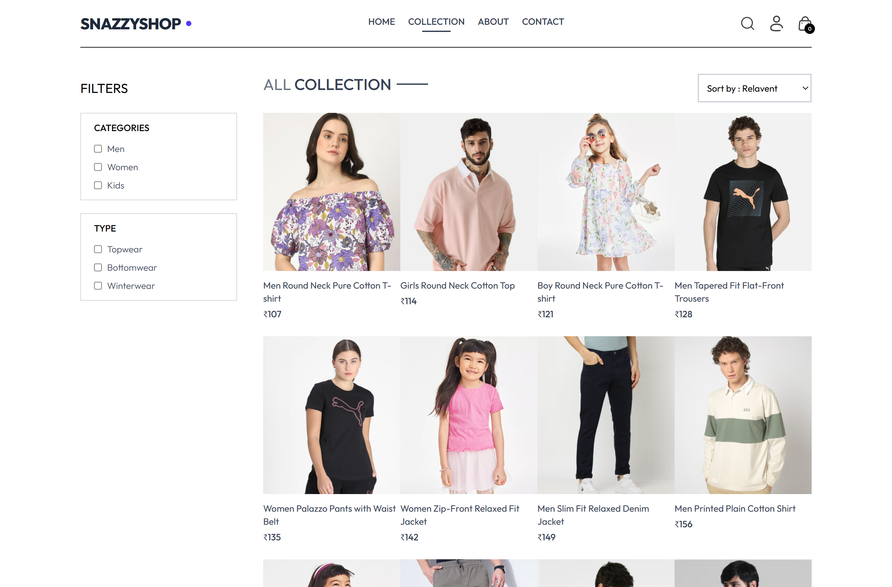 |

| Product Detail | User Login |
| :---: | :---: |
| 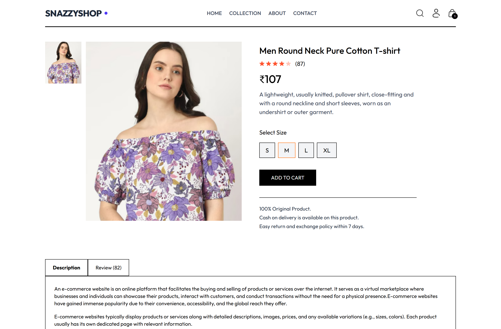 | 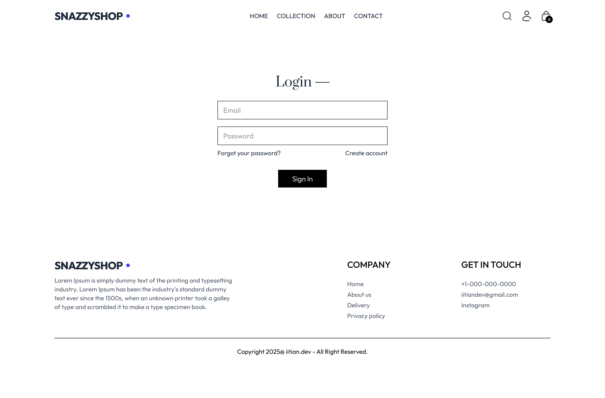 |

| Shopping Cart | Checkout |
| :---: | :---: |
| 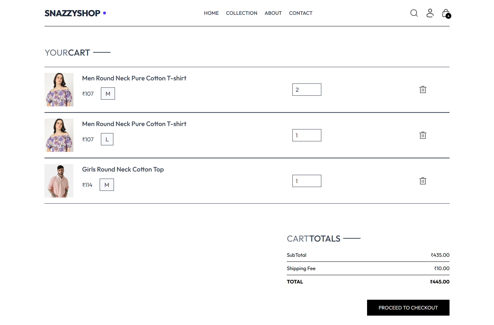 | 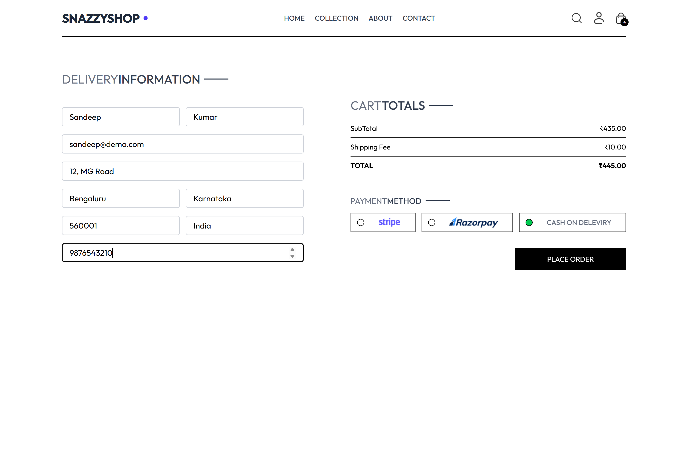 |

| My Orders | 📱 Fully Responsive |
| :---: | :---: |
| 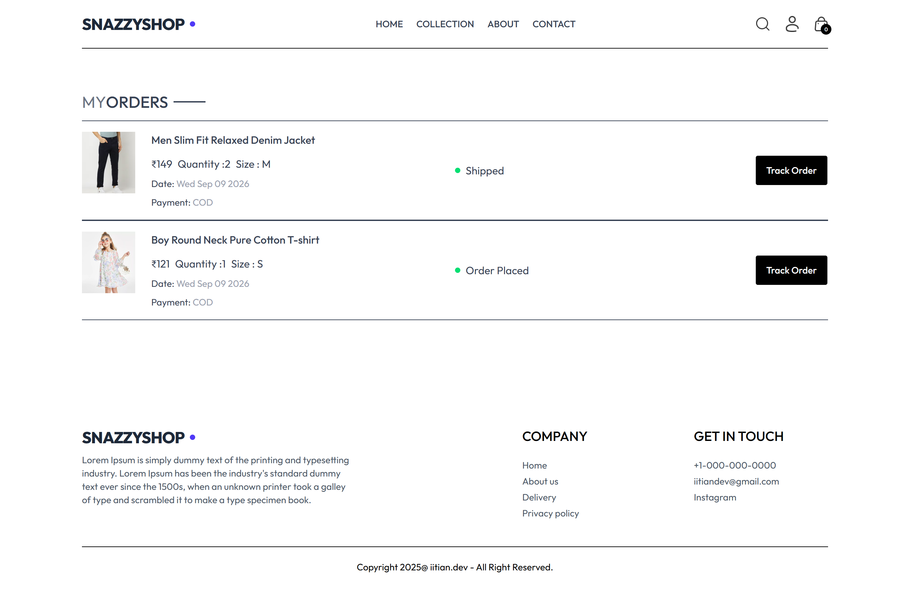 |  |

### 🛠️ Admin Panel

| Admin Login | Add Product |
| :---: | :---: |
| 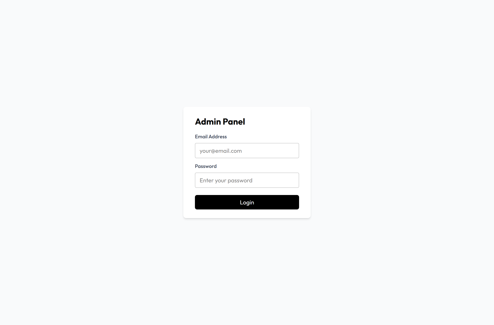 | 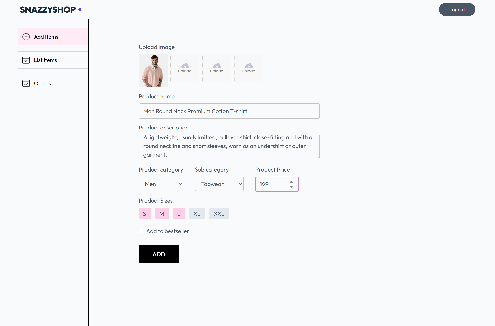 |

| Products List | Order Management |
| :---: | :---: |
| 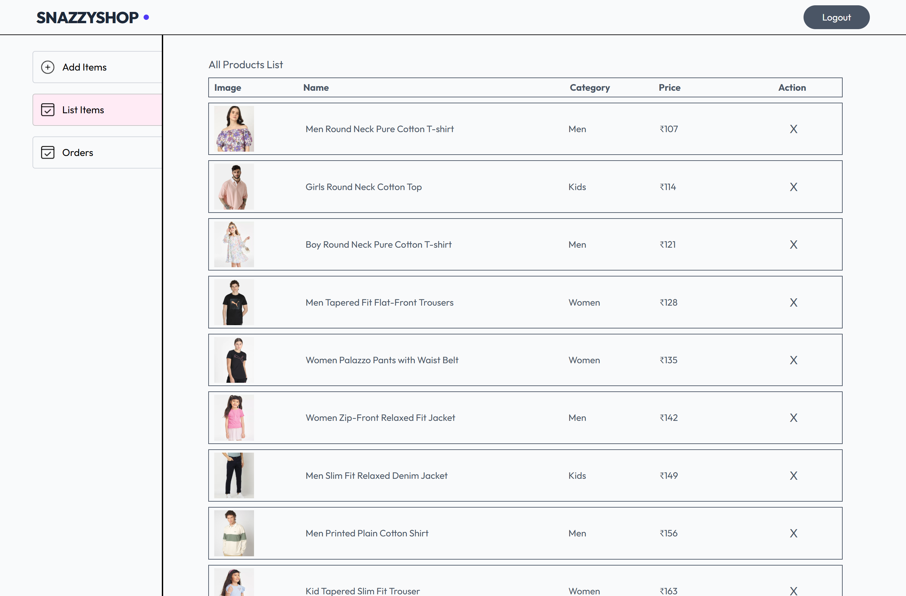 | 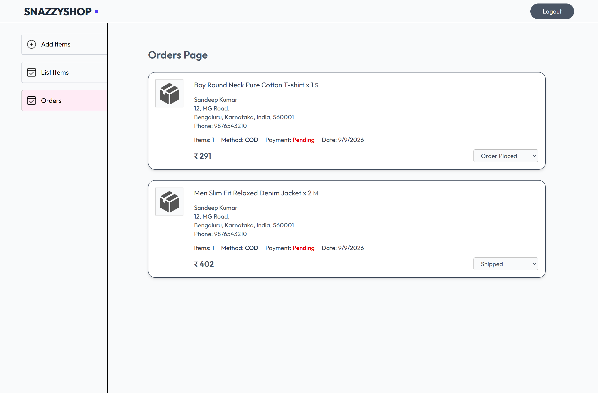 |

---

## 🧰 Tech Stack

| Layer | Technology |
| --- | --- |
| **Frontend** | React 19, React Router 7, Tailwind CSS 4, Vite 6 |
| **Admin Panel** | React 19, React Router 7, Tailwind CSS 4, Vite 6 |
| **Backend** | Node.js, Express 5 |
| **Database** | MongoDB + Mongoose |
| **Auth** | JWT (JSON Web Tokens) |
| **File Storage** | Multer + Cloudinary |
| **Payments** | Cash on Delivery (Stripe / Razorpay scaffolded) |
| **Notifications** | React Toastify |

---

## 🏗️ Architecture

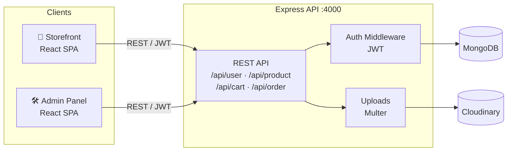

In production the Express server can host **all three apps from a single URL** — storefront at `/`, admin panel at `/admin`, and the API at `/api`.

---

## 🔌 API Reference

Base URL: `{backendUrl}/api`

| Method | Endpoint | Auth | Description |
| --- | --- | --- | --- |
| `POST` | `/user/register` | — | Create account, returns JWT |
| `POST` | `/user/login` | — | Login, returns JWT |
| `POST` | `/user/admin` | — | Admin login |
| `GET` | `/product/list` | — | List all products |
| `POST` | `/product/single` | — | Get one product by id |
| `POST` | `/product/add` | Admin | Add product (+ multipart images) |
| `POST` | `/product/remove` | Admin | Remove product |
| `POST` | `/cart/add` | User | Add item to cart |
| `POST` | `/cart/update` | User | Update item quantity |
| `POST` | `/cart/get` | User | Fetch user cart |
| `POST` | `/order/place` | User | Place COD order |
| `POST` | `/order/userorders` | User | Get user's orders incl. tracking history |
| `POST` | `/order/list` | Admin | List all orders |
| `POST` | `/order/status` | Admin | Update order status (appended to tracking history) |
| `POST` | `/review/add` | User | Add or update a product review |
| `POST` | `/review/product` | — | Get all reviews for a product |
| `POST` | `/review/delete` | User | Delete own review |
| `POST` | `/review/list` | Admin | List all reviews |
| `POST` | `/review/admin-delete` | Admin | Delete any review |
| `POST` | `/wishlist/get` | User | Fetch user wishlist (product ids) |
| `POST` | `/wishlist/toggle` | User | Add or remove a product from wishlist |

---

## 🚀 Getting Started

### Prerequisites

- Node.js **v18+** and npm
- A MongoDB instance (local or [Atlas](https://www.mongodb.com/atlas))
- A [Cloudinary](https://cloudinary.com/) account (for product image uploads)

### Installation

```bash
# 1. Clone the repository
git clone https://github.com/sandeep780049/shop-website.git
cd shop-website

# 2. Backend
cd backend && npm install

# 3. Storefront
cd ../frontend && npm install

# 4. Admin panel
cd ../admin && npm install
```

### Environment Variables

**`backend/.env`**
```env
MONGODB_URI=<your-mongodb-connection-string>
JWT_SECRET=<any-strong-secret>
ADMIN_EMAIL=<admin-login-email>
ADMIN_PASSWORD=<admin-login-password>
CLOUDINARY_NAME=<cloudinary-cloud-name>
CLOUDINARY_API_KEY=<cloudinary-api-key>
CLOUDINARY_SECRET_KEY=<cloudinary-api-secret>
PORT=4000
```

**`frontend/.env`** and **`admin/.env`**
```env
VITE_BACKEND_URL=http://localhost:4000
```

### Run in Development

```bash
# Terminal 1 — API server on http://localhost:4000
cd backend && npm run server

# Terminal 2 — storefront on http://localhost:5173
cd frontend && npm run dev

# Terminal 3 — admin panel on http://localhost:5174
cd admin && npm run dev
```

### Run as a Single Production Server

```bash
# Build both SPAs, then let Express serve everything
cd frontend && npm run build
cd ../admin && npm run build
cd ../backend && npm start
```

Open **http://localhost:4000** → storefront · **/admin** → admin panel · **/api** → REST API

---

## 📂 Project Structure

```
shop-website/
│
├── frontend/                 # 🛒 Customer storefront (React + Vite)
│   └── src/
│       ├── components/       # Navbar, Hero, ProductItem, CartTotal, …
│       ├── pages/            # Home, Collection, Product, Cart, Orders, …
│       ├── context/          # ShopContext (global cart, auth, search state)
│       └── assets/           # Product images & icons
│
├── admin/                    # 🛠️ Admin panel (React + Vite, base /admin/)
│   └── src/
│       ├── components/       # Login, Navbar, Sidebar
│       └── pages/            # Add, List, Orders
│
├── backend/                  # ⚙️ Express REST API
│   ├── config/               # MongoDB & Cloudinary connections
│   ├── controllers/          # Business logic (user, product, cart, order)
│   ├── models/               # Mongoose schemas
│   ├── routes/               # API route definitions
│   ├── middleware/           # JWT auth (user + admin), Multer uploads
│   └── server.js             # App entry — serves API + both built SPAs
│
└── screenshots/              # 📸 App screenshots used in this README
```

---

## 🗺️ Roadmap

- [ ] 💳 Complete Stripe & Razorpay payment flows
- [x] ⭐ Product reviews & ratings
- [x] 🚚 Order tracking with status timeline
- [ ] 👤 User profile & address book
- [ ] 📧 Email notifications (order confirmation, shipping updates)
- [ ] 📊 Sales analytics dashboard for admins
- [ ] 🌍 Internationalization & multi-currency

---

## 👤 Author & Acknowledgments

**Sandeep Kumar** — [@sandeep780049](https://github.com/sandeep780049)

- UI inspired by the open-source community and modern e-commerce design patterns
- Built to demonstrate end-to-end full-stack skills: frontend, backend, database design, auth, and deployment

⭐ **Found this useful? Give the repo a star!**

---
